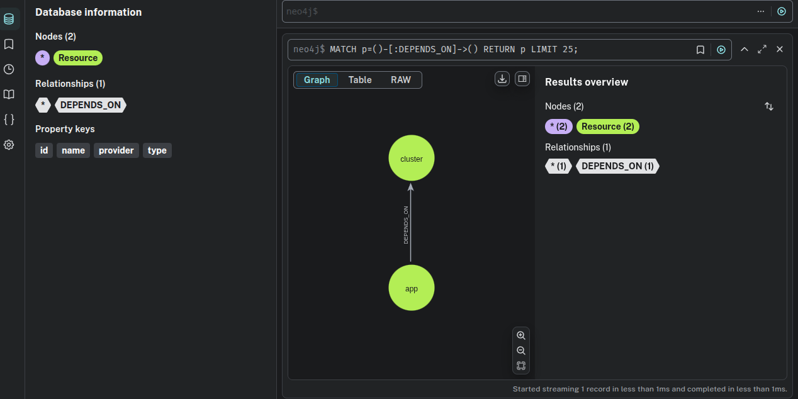

# Terraform GraphX


`terraform-graphx` generates a dependency graph of your Terraform resources and can update a Neo4j database with the infrastructure state.

## Example Graph Visualization

Below is an example of a dependency graph visualized in Neo4j Browser:




## Features

- **Standalone Binary**: A single Go binary that can be used as a command-line tool (`terraform-graphx`).
- **Machine-Readable Output**: Generates a dependency graph in JSON or Cypher format.
- **Neo4j Integration**: Can directly update a Neo4j database with the graph data.
- **Modular Design**: Built with separate components for parsing, graph building, and output formatting.

## AI-Enhanced Infrastructure Management

The primary goal of `terraform-graphx` is to empower AI agents like **Gemini CLI** with a deep understanding of your infrastructure. The core idea is for agents to use a **Model Context Protocol (MCP)** to connect to and query the Neo4j database where `terraform-graphx` stores the infrastructure graph.

By providing a constantly updated, queryable graph of Terraform resources, this tool serves as the backbone for an MCP, enabling AI agents to:
- **Gain Context**: Quickly understand the relationships and dependencies between hundreds or thousands of resources in large-scale projects.
- **Perform Impact Analysis**: Accurately predict the ripple effects of a change before it's applied.
- **Automate Complex Tasks**: Autonomously generate plans, write code, and execute changes with a lower risk of error.

This approach transforms your infrastructure from a static collection of configuration files into a dynamic knowledge base, paving the way for more intelligent and autonomous operations through an AI-queried MCP.

## Installation

You can install `terraform-graphx` by downloading a pre-compiled binary or by building it from source.

### Pre-compiled Binaries (Recommended)

The easiest way to install `terraform-graphx` is to download the latest release from the **GitHub Releases** page for this repository.

1. Download the archive for your operating system and architecture.
2. Extract the `terraform-graphx` binary.
3. Move the binary to a directory in your system's `PATH`.

**Example for Linux/macOS:**

```bash
# Replace with the correct URL from the releases page
wget <URL_TO_TAR.GZ>
tar -xzf terraform-graphx_*.tar.gz
sudo mv terraform-graphx /usr/local/bin/
```

### Build from Source

If you have Go (version 1.22+) installed, you can build `terraform-graphx` from source.

1. Clone the repository:

    ```bash
    git clone https://github.com/daniellvog/terraform-graphx.git
    cd terraform-graphx
    ```

2. Build the binary:

    ```bash
    go build -o terraform-graphx .
    ```

3. Place the binary in your `PATH`:

    ```bash
    sudo mv terraform-graphx /usr/local/bin/
    ```

4. Verify the installation:

    ```bash
    terraform -help
    ```

## Neo4j Setup

`terraform-graphx` includes built-in Docker support to easily manage Neo4j databases for your Terraform projects. Each project can have its own isolated Neo4j instance.

### Quick Start with Built-in Docker Support

The simplest way to get started is using the built-in Docker commands:

1. **Initialize configuration:**

    ```bash
    terraform-graphx init
    ```

    This command will:
    - Create a `.terraform-graphx.yaml` configuration file with a randomly generated password
    - Set up the default Neo4j Docker image (neo4j:community)
    - Create the `neo4j-data` directory for data persistence
    - Add both files to `.gitignore` if you're in a Git repository

2. **Start Neo4j:**

    ```bash
    terraform-graphx start
    ```

    This command will:
    - Pull the Neo4j Docker image if not already present
    - Start a Neo4j container in the background
    - Mount the `neo4j-data` directory as a volume
    - Use the credentials from your configuration file

3. **Stop Neo4j:**

    ```bash
    terraform-graphx stop
    ```

    This command will:
    - Stop the running Neo4j container
    - Remove the container
    - Preserve all data in the `neo4j-data` directory

4. **Access the Neo4j Browser (optional):**

    Open <http://localhost:7474> in your browser to access the Neo4j web interface.

    - Username: `neo4j`
    - Password: The password shown when you ran `terraform-graphx init`

### Important: Working with Existing Data

If you have existing Neo4j data in the `neo4j-data` directory, be aware that:

- **Neo4j ignores the password in the config file** when starting with existing data
- The database will use the password stored in the existing data
- The `start` command will warn you when this happens

**If you get authentication errors:**

1. **Option 1 - Start fresh** (development/testing):
   ```bash
   terraform-graphx stop
   sudo rm -rf neo4j-data
   rm -f .terraform-graphx.yaml
   terraform-graphx init
   terraform-graphx start
   ```

2. **Option 2 - Use existing password** (production):
   Edit `.terraform-graphx.yaml` and set the password to match your existing database.

### Alternative: Manual Docker Setup

If you prefer to manage Docker manually, you can still do so:

1. **Create a data directory in your Terraform project:**

    ```bash
    mkdir neo4j-data
    ```

2. **Start a Neo4j container for your project:**

    ```bash
    docker run -d \
      --name terraform-graphx-neo4j \
      -p 7474:7474 -p 7687:7687 \
      -v $(pwd)/neo4j-data:/data \
      -e NEO4J_AUTH=neo4j/your-password \
      neo4j:community
    ```

    Replace `your-password` with a secure password.

3. **To work on a different project:**

    Simply navigate to the other project directory and use `terraform-graphx start` or start a new container with that project's `neo4j-data` directory.

### Why Project-Specific Databases?

Neo4j Community Edition has a limitation: it only supports one database per instance. To maintain separate graphs for different Terraform projects, `terraform-graphx` uses project-specific data volumes. This allows you to:

- Isolate graphs for each Terraform project
- Start and stop databases independently
- Avoid conflicts between different infrastructure states

## Configuration

`terraform-graphx` uses a configuration file to store Neo4j connection settings and Docker configuration.

### Initialize Configuration

Create a configuration file in your project directory:

```bash
terraform-graphx init
```

This creates a `.terraform-graphx.yaml` file with default values and a randomly generated password:

```yaml
neo4j:
  uri: bolt://localhost:7687
  user: neo4j
  password: <randomly-generated-password>
  docker_image: neo4j:community
```

**Important:** This file contains sensitive credentials and should **not** be committed to version control.

When you run `terraform-graphx init`, the command will automatically:
- Generate a secure random password for Neo4j
- Create the `.terraform-graphx.yaml` configuration file
- Create the `neo4j-data/` directory for data persistence
- Add both `.terraform-graphx.yaml` and `neo4j-data/` to your `.gitignore` file if you are in a Git repository

This helps prevent accidentally committing sensitive credentials and local database files.

If you initialize a Git repository *after* running `init`, please make sure to add them to your `.gitignore` file manually.

### Customizing the Configuration

You can edit the `.terraform-graphx.yaml` file to:
- Change the Neo4j Docker image (e.g., `neo4j:5.15.0` for a specific version)
- Modify connection settings if needed

### Verify Database Connection

Before using terraform-graphx, verify that the connection to Neo4j works:

```bash
terraform-graphx check database
```

This command will:

- Load credentials from `.terraform-graphx.yaml`
- Attempt to connect to Neo4j
- Report the connection status

### Configuration Priority

When running commands, `terraform-graphx` loads configuration in this order of priority:

1. **Command-line flags** (highest priority)
2. **Configuration file** (`.terraform-graphx.yaml`)
3. **Default values** (lowest priority)

This allows you to override configuration file settings with flags when needed.

## Usage

Navigate to your Terraform project directory and run the `terraform-graphx` command.

### Prerequisites

- **Terraform**: You must have `terraform` installed and have initialized your project with `terraform init`.

### Generating a JSON Graph

By default, `terraform-graphx` outputs the dependency graph in JSON format.

```bash
terraform-graphx > graph.json
```

**Example JSON Output:**

```json
{
  "nodes": [
    {
      "id": "null_resource.cluster",
      "type": "null_resource",
      "provider": "registry.terraform.io/hashicorp/null",
      "name": "cluster",
      "attributes": {
        "id": "...",
        "triggers": {
          "cluster_name": "my-cluster"
        }
      }
    },
    {
      "id": "null_resource.app",
      "type": "null_resource",
      "provider": "registry.terraform.io/hashicorp/null",
      "name": "app",
      "attributes": {
        "id": "...",
        "triggers": {
          "cluster_id": "..."
        }
      }
    }
  ],
  "edges": [
    {
      "from": "null_resource.app",
      "to": "null_resource.cluster",
      "relation": "DEPENDS_ON"
    }
  ]
}
```

### Generating Cypher Statements

You can also output the graph as a series of Cypher `MERGE` statements, which are idempotent.

```bash
terraform-graphx --format=cypher > graph.cypher
```

**Example Cypher Output:**

```cypher
MERGE (n:Resource {id: 'null_resource.cluster'})
SET n.type = 'null_resource', n.provider = 'registry.terraform.io/hashicorp/null', n.name = 'cluster';
MERGE (n:Resource {id: 'null_resource.app'})
SET n.type = 'null_resource', n.provider = 'registry.terraform.io/hashicorp/null', n.name = 'app';

MATCH (from:Resource {id: 'null_resource.app'}), (to:Resource {id: 'null_resource.cluster'})
MERGE (from)-[:DEPENDS_ON]->(to);
```

### Updating a Neo4j Database

The `--update` flag allows you to push the graph directly into a Neo4j database. With the configuration file, this is much simpler:

```bash
terraform-graphx --update
```

The tool will read the Neo4j credentials from your `.terraform-graphx.yaml` file.

You can also override the configuration file settings using flags:

```bash
terraform-graphx --update \
  --neo4j-uri="bolt://localhost:7687" \
  --neo4j-user="neo4j" \
  --neo4j-pass="your-password"
```

The tool uses idempotent `MERGE` statements, so you can run this command multiple times without creating duplicate nodes or relationships.

## Quick Start Workflow

Here's a complete workflow for using `terraform-graphx` with Neo4j:

1. **Set up Neo4j for your project:**

    ```bash
    # Create data directory
    mkdir neo4j-data
    
    # Start Neo4j container
    docker run -d \
      --name terraform-graphx-neo4j \
      -p 7474:7474 -p 7687:7687 \
      -v $(pwd)/neo4j-data:/data \
      -e NEO4J_AUTH=neo4j/mypassword \
      neo4j:latest
    ```

2. **Initialize terraform-graphx configuration:**

    ```bash
    # Create config file
    terraform-graphx init config
    
    # Edit .terraform-graphx.yaml and set your password
    # neo4j:
    #   uri: bolt://localhost:7687
    #   user: neo4j
    #   password: mypassword
    ```

3. **Verify the connection:**

    ```bash
    terraform-graphx check database
    ```

4. **Update the graph in Neo4j:**

    ```bash
    # Initialize your Terraform project if not already done
    terraform init
    
    # Update the graph
    terraform-graphx --update
    ```

5. **Query your infrastructure in Neo4j Browser:**

    Open <http://localhost:7474> and run Cypher queries like:
    
    ```cypher
    // Find all resources
    MATCH (n:Resource) RETURN n
    
    // Find all dependencies
    MATCH (n:Resource)-[r:DEPENDS_ON]->(m:Resource) RETURN n, r, m
    ```

6. **When switching to another project:**

    ```bash
    # Stop current container
    docker stop terraform-graphx-neo4j
    docker rm terraform-graphx-neo4j
    
    # Navigate to other project and repeat steps 1-5
    ```

## CLI Commands

### Configuration Commands

- `terraform-graphx init config` - Create a `.terraform-graphx.yaml` configuration file with default values
- `terraform-graphx check database` - Verify Neo4j database connectivity using the configuration file

### Graph Commands

- `terraform-graphx` - Generate and output the dependency graph (default format: JSON)
- `terraform-graphx --format=<format>` - Specify output format (`json` or `cypher`)
- `terraform-graphx --update` - Update the Neo4j database with the current infrastructure graph
- `terraform-graphx --plan=<file>` - Use a specific Terraform plan file instead of generating one

### Flags

- `--format <format>`: The output format for the graph. Can be `json` (default) or `cypher`.
- `--plan <file>`: Path to a pre-generated Terraform plan file. If not provided, `terraform-graphx` will generate one.
- `--update`: A boolean flag to enable updating a Neo4j database.
- `--neo4j-uri <uri>`: Override the Neo4j URI from the config file (e.g., `bolt://localhost:7687`).
- `--neo4j-user <user>`: Override the Neo4j username from the config file.
- `--neo4j-pass <password>`: Override the Neo4j password from the config file.

**Note:** Command-line flags take precedence over configuration file settings.

## Development

This project is written in Go and uses the Cobra library for the CLI. The code is structured to separate concerns, making it easier to maintain and test.

- **`cmd/`**: Contains the Cobra CLI command definitions. These files are responsible for parsing flags and arguments and then delegating to the `runner`.
- **`internal/runner`**: Orchestrates the application's workflow. It calls `terraform graph` and uses the other `internal` packages to parse the graph and handle output.
- **`internal/config`**: Manages configuration loading from files and merging with command-line flags.
- **`internal/parser`**: Parses the JSON graph output generated from `terraform graph` DOT format.
- **`internal/formatter`**: Contains logic for JSON and Cypher output.
- **`internal/neo4j`**: Handles all communication with the Neo4j database.
